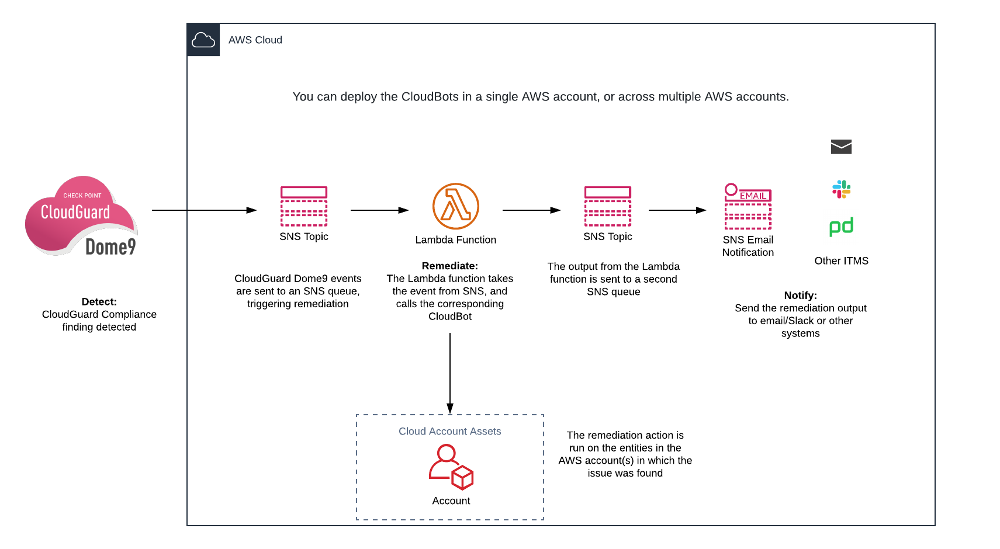
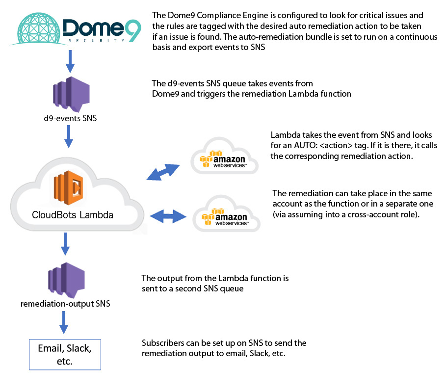
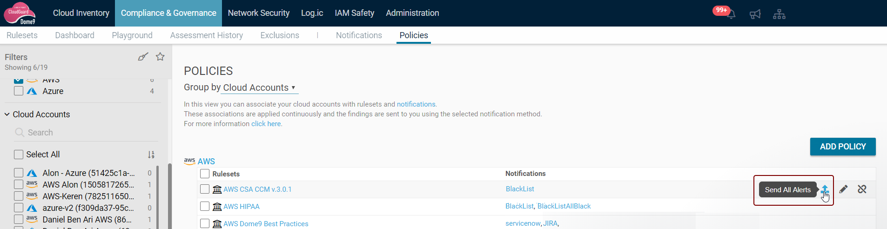

# CloudBots

  - [Overview](#overview)
      - [What are Dome9 CloudBots?](#what-are-dome9-cloudbots)
      - [What does it do?](#what-does-it-do)
      - [How does it work?](#how-does-it-work)
      - [The Bots](#the-bots)
      - [Deployment modes](#deployment-modes)
  - [Onboarding](#onboarding)
      - [Setup your AWS account(s) for
        CloudBots](#setup-your-aws-accounts-for-cloudbots)
      - [Onboarding for Multi mode](#onboarding-for-multi-mode)
  - [Setup your Dome9 account](#setup-your-dome9-account)
      - [Configure the rules](#configure-the-rules)
      - [Configure the Continuous Compliance
        policy](#configure-the-continuous-compliance-policy)
  - [Use the CloudBots without Dome9](#use-the-cloudbots-without-dome9)

# Overview

## What are Dome9 CloudBots?

Cloud-Bots is an autoremediation solution for AWS, built on top of the
CloudGuard Dome9 Continuous Compliance capabilities.

They can also be used standalone, without Dome9, to remedy issues in AWS
accounts. Details are included how to configure and trigger them.

## What does it do?

You can configure Dome9 Continuous Compliance to assess your cloud
accounts with rulesets, to continuously check the compliance of your
accounts, and issue reports and findings in near real-time for issues
that are found.

CloudBots extends this by adding an option to trigger an immediate
remediation action on the problematic cloud entity in your account,
directly from the compliance rule that fails. The rule triggers a bot
that runs in your account, that provides a remedy to the issue that
failed the rule.

For example, a rule that checks whether a customer-managed KMS has
rotation enabled, could trigger the bot *kms\_enable\_rotation*, to
enable rotation. Similarly, a rule that checks whether CloudTrail is
enabled could trigger the bot *cloud\_trailenable*, to create and enable
a CloudTrail.

You can also use the CloudBots without Dome9, using the same triggers,
but sourced from your application (details for configuring this
included).

## How does it work?

To use Dome9 cloudbots, you deploy a CFT stack in your AWS account (or
one of your accounts). This stack has the bots, and an AWS Lambda
function that runs the bots.

You also create an SNS in your AWS account, which is triggers the Lambda
function. Finally, to connect a specific compliance rule in a ruleset
with a bot, you add a remediation flag in the rule. If this rule fails
during a compliance assessment, the Dome9 Compliance Engine will send an
event message to the SNS, with details about the bot to be triggered
(and any parameters that are needed when it is run). This will trigger
the Lambda function, which runs the specified bot on the entity in
question.

The remedial action is triggered in near real-time after the rule fails.
The next time the rule is run the issue should already be remedied, and
the rule should pass.

## The Bots

Refer to [this](bots/Bots.md) file for a list of the bots, what each one
does, and an example of a rule that could be used to trigger it.

## Deployment modes

You can deploy the CloudBots in a single AWS account, or across multiple
AWS accounts.

### Single account mode

The default mode is 'single' account. Remediations will be applied to
entities in a single account. It follows this workflow:

### Multi mode

In multi-mode, remediations are applied for more than one account. The
lambda function is deployed in only one account, but uses cross-account
roles to run bots in other accounts. It follows this workflow:

# Onboarding

## Setup your AWS account(s) for CloudBots

Follow these steps for each region in your account in which you want to
deploy the bots.

1.  Click 
    and select the region in which you wish to deploy the stack. This will run
    a script in the CFT console to deploy the cloudbot stack in the
    selected region.
2.  In the **Select Template**, click **Next** (no need to make a
    selection)
3.  In the **Parameters** section select the deployment mode, *single*
    or *multi* mode. Enter an email address for SNS notifications in the
    EmailAddress field (optional),then click **Next**
4.  In the **Options** page, click **Next** (no need to make any
    selections)
5.  In the **Review** page, select the options:

`  I acknowledge that AWS CloudFormation might create IAM resources `

`  I acknowledge that AWS CloudFormation might create IAM resources with
custom names. `

6.  Click **Create Change Set**, then **Execute**. The stack will be
    created in your AWS account. It will appear as *dome9CloudBots* in
    the list of stacks in the CloudFormation console.
7.  Select the stack, and then select the **Outputs** section.
8.  Copy the two ARNs there, *OutputTopicARN* and *InputTopicARN* and
    save them; they will be used to setup the SNS to trigger the bots,
    and the output reporting channel.

## Onboarding for Multi mode

For multi-mode, you will setup one account as above for the single mode,
and then set up cross account roles in each additional account.

On the AWS CFT console, for your account, perform these steps:

1.  Set the ACCOUNT\_MODE environment variable to *multi*.
2.  Edit the *trust\_policy.json* file (in the
    *cross\_account\_role\_configs* folder),to add the account id of the
    additional account. Then, run the following commands:

<!-- end list -->

    cd cross_account_role_configs
    ./create_role.sh <aws profile>

This script will create the IAM role and policy and the cross-account
role for the additional account.

# Setup your Dome9 account

On Dome9 you must add remediation tags to rules in a compliance ruleset

## Configure the rules

Follow these steps in your Dome9 account to tag the compliance rules &
rulesets to use bots as a remediation step.

1.  In the Dome9 console, navigate to the Rulesets page in the
    Compliance & Governance menu.

2.  Select the rules for which you want to add a remediation step.

3.  In the Compliance Section add a row with the following string:
    `AUTO: <bot-name> <params>` where *bot-name* is the name of the bot,
    and *params* is a list of arguments for the bot (if any).
    
    For example, `AUTO: ec2_stop_instance` will run the bot to stop an
    EC2 instance.

## Configure the Continuous Compliance policy

Once the rules in the ruleset have been tagged for remediation, set up a
Continuous Compliance policy to run the ruleset, and send findings to
the SNS.

1.  Navigate to the **Policies** page in the Compliance & Governance
    menu.
2.  Click **ADD POLICY** (on the right).
3.  Select the account from the list, then click **NEXT**. For 'single'
    mode, this will be the one account in which the bots are deployed.
    For 'multi' mode, select the accounts (they must be configured with
    cross-account roles).
4.  Select the ruleset from the list, then click **NEXT**.
5.  Click **ADD NOTIFICATION**.
6.  Select *SNS notification for each new finding as soon as it is
    discovered*, and enter the ARN for the SNS (*InputTopicARN*, created
    above). Select option *JSON - Full entity*, and then click **SAVE**.

**Note:** Dome9 will send event messages to the SNS for new findings. To
send events for previous findings, follow these steps:

1.  Navigate to the **Policies** page.
2.  Find the ruleset and account in the list, and hover over the right
    of the row, then click on the *Send All Alerts* icon.
    
3.  Select the *SNS* Notification Type option, and the Notification
    Policy (the one created above), then click **SEND**. Dome9 will send
    event messages to the SNS for findings.

# Use the CloudBots without Dome9

You can use the CloudBots without a Dome9 account. In this case you must
send messages to the SNS for each event that requires remediation. The
message should have the following format:

    {
      "reportTime": "2018-03-20T05:40:42.043Z",
      "rule": {
        "name": "<name for rule>",
        "complianceTags": "AUTO: <bot-name>"
      },
      "status": "Failed",
      "account": {
        "id": "************"
      },
      "entity": {
        "accountNumber": "************",
        "id": "i-*****************",
        "name": "************",
        "region": "us_west_2",
      }
    }

where *account: id* and *accountNumber* is your AWS account number (from
AWS)

*status* is marked *Failed*

*entity: id* is the id for the entity that failed the rule
